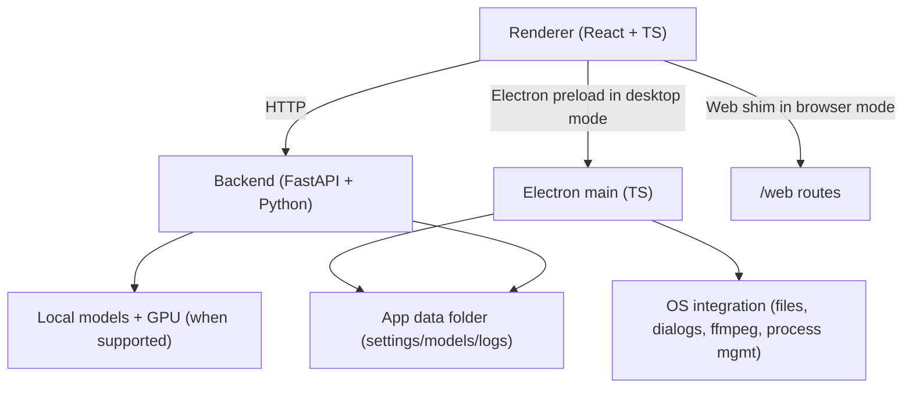

# LTX Web

## What this fork adds compared with **LTX Desktop**

### Runtime and deployment

- **Web mode**: run the renderer in a browser without Electron by using the backend `/web/*` routes and the web shim.
- **Web-safe file and project asset handling**: browser uploads, servable local asset URLs, and HTTP replacements for Electron file IPC.
- **Model readiness and first-run recommendations**: backend readiness checks plus suggested download bundles based on detected VRAM.

### Low-VRAM local generation

- **VRAM-tiered local generation**: `Auto`, `High VRAM`, `Medium VRAM`, `Low VRAM`, and `Very Low VRAM` modes with per-tier block-swap behavior and resolution guidance.
- **Low-VRAM LTX pipeline**: sequential component offloading, transformer block swap, text-encoder block swap, and SageAttention where available.
- **GGUF support for local video generation**: GGUF diffusion models, GGUF text encoders, GGUF model discovery, and GGUF download recommendations.

### Local model flexibility and workflows

- **Custom local model selection**: choose checkpoints or GGUF models, text encoder variants, Z-Image variants, upscaler, and one or more LoRAs from Settings.
- **Multiple LoRA support**: keep more than one selected LoRA with per-LoRA strength instead of a single preferred LoRA.
- **Extra local model surfaces** beyond the original defaults: IC-LoRA, depth, pose, person detector, and Z-Image GGUF options.
- **Gemini-backed timeline gap prompt suggestions**: prompt generation for timeline gap-fill flows in the video editor.

## Features

- Text-to-video generation
- Image-to-video generation
- Audio-to-video generation
- Video edit generation (Retake)
- IC-LoRA / style transfer workflows
- Video Editor interface
- Timeline gap-fill prompt suggestions
- Video editing projects
- Desktop mode via Electron
- Web mode via browser + FastAPI

## Local mode

| Platform / hardware | Generation mode | Notes |
| --- | --- | --- |
| Windows + NVIDIA CUDA GPU | Local generation supported | Practical support starts around 8-12 GB depending on model choice |
| Linux + NVIDIA CUDA GPU | Local generation supported | Practical support starts around 8-12 GB depending on model choice |
| macOS (Apple Silicon builds) | Local generation not currently supported | UI-only use may work, but local generation is not supported |

## VRAM tiers

This fork adds explicit VRAM tiers so local generation can scale down to smaller NVIDIA GPUs by combining offloading, block swap, and GGUF models.

### Recommended tiers

| VRAM tier | GPU memory | Typical mode | Recommended local resolutions |
| --- | --- | --- | --- |
| High VRAM | **24GB+** | Best local experience | 540p, 720p, 1080p |
| Medium VRAM | **16-23GB** | Strong local experience | 540p, 720p |
| Low VRAM | **12-15GB** | Works with heavier offloading | 480p, 540p |
| Very Low VRAM | **8-11GB** | Most constrained local mode | 360p, 480p |

Practical guidance:

- **24GB+**: use `Auto` or `High VRAM`; prefer `Q8_0` GGUF if using quantized models
- **16-23GB**: use `Auto` or `Medium VRAM`; `Q5_1` / `Q4_K_M` GGUF is often a good fit
- **12-15GB**: use `Low VRAM`; prefer `Q4_K_M`
- **8-11GB**: use `Very Low VRAM`; prefer `Q4_0` and smaller resolutions

## System requirements

### Windows / Linux (local generation)

- 64-bit OS
- NVIDIA GPU with CUDA support
- **8GB+ VRAM for constrained local mode; 12GB+ recommended**
- NVIDIA driver installed
- 16GB+ system RAM recommended (32GB+ preferred for smoother low-VRAM workflows)
- Plenty of disk space for model weights and outputs

## Install

1. Download the latest installer from GitHub Releases: [Releases](../../releases)
2. Install and launch **LTX Web**
3. Complete first-run setup

## First run & data locations

LTX Web stores app data (settings, models, logs) in:

- **Windows:** `%LOCALAPPDATA%\LTXDesktop\`
- **macOS:** `~/Library/Application Support/LTXDesktop/`
- **Linux:** `$XDG_DATA_HOME/LTXDesktop/` (default: `~/.local/share/LTXDesktop/`)

Model weights are downloaded into the `models/` subfolder (this can be large and may take time).

On first launch you may be prompted to review/accept model license terms (license text is fetched from Hugging Face; requires internet).

This fork adds GPU-aware first-run checks that can suggest local model bundles for your hardware.

## Model support added in this fork

- **Diffusion models**: standard checkpoints and GGUF checkpoints
- **Text encoders**: standard folders, `.safetensors` variants, and GGUF variants
- **LoRAs**: default distilled LoRA plus multiple custom LoRAs
- **Image generation models**: Z-Image Turbo standard and GGUF variants
- **Processor models**: depth, pose, and person detector models for conditioning flows

Supported model workflows:

- **Fast (distilled)**: distilled base with fast settings
- **Balanced**: dev base + distilled LoRA at 8 steps
- **Quality/Pro**: dev base with configurable steps and optional 2x upscaler refinement
- **Custom**: choose your own checkpoint / GGUF / LoRAs / text encoder

## Text encoding

This fork adds selectable local text encoder variants, including GGUF-backed options, instead of assuming a single default text encoder layout.

### Gemini API key (optional)

Used for AI prompt suggestions. When enabled, prompt context and frames may be sent to Google Gemini.

Current Gemini usage in this fork is focused on **timeline gap-fill prompt suggestion** flows in the editor.

## Web mode

This fork can run as a standalone browser app using the same backend used by the desktop app.

### Quick start

```bash
python run.py --host 127.0.0.1 --port 8000
```

Then open:

```text
http://127.0.0.1:8000
```

### Remote access

To access the app from other machines on your network, bind to `0.0.0.0`:

```bash
python run.py --host 0.0.0.0 --port 8000
```

Then open from any device on the same network:

```text
http://<your-machine-ip>:8000
```

For remote access over the internet, you can use tunneling tools like [Cloudflare Tunnel](https://developers.cloudflare.com/cloudflare-one/connections/connect-networks/), [ngrok](https://ngrok.com/), or [Tailscale](https://tailscale.com/).

Example with Cloudflare Tunnel:

```bash
cloudflared tunnel --url http://localhost:8000
```

> **Note:** The backend requires an NVIDIA GPU for local generation. Remote/web mode lets you access the UI from any browser, but the GPU must still be on the machine running the backend.

### Alternative helper scripts

```bash
./run-web.sh
./restart-web.sh
./stop-web.sh
```

### What web mode adds

- Browser-based UI without Electron
- HTTP replacements for Electron file / app IPC
- Backend-served file upload, project asset, and local file serving helpers
- Shared frontend codepath between desktop and browser deployments
- CORS configuration for remote origins via `CORS_ORIGINS` environment variable

## Architecture

LTX Web is split into three main layers:

- **Renderer (`frontend/`)**: TypeScript + React UI.
  - Calls the local backend over HTTP.
  - Uses Electron in desktop mode.
  - Falls back to a web shim in browser mode.
- **Electron (`electron/`)**: TypeScript main process + preload.
  - Owns app lifecycle and OS integration in desktop builds.
- **Backend (`backend/`)**: Python + FastAPI local server.
  - Orchestrates generation, model downloads, GPU execution, web-mode routes, and model selection.



## Development (quickstart)

Prereqs:

- Node.js
- `uv` (Python package manager)
- Python 3.13+
- Git

Setup:

```bash
pnpm setup:dev
```

Desktop dev:

```bash
pnpm dev
```

Debug:

```bash
pnpm dev:debug
```

Typecheck:

```bash
pnpm typecheck
```

Backend tests:

```bash
pnpm backend:test
```

### Running in web mode during development

Backend:

```bash
cd backend
uv run python ltx2_server.py
```

Frontend:

```bash
WEB_MODE=true BACKEND_URL=http://127.0.0.1:8000 npx vite --host
```

Or use:

```bash
python run.py
```

## Telemetry

LTX Web collects minimal, anonymous usage analytics (app version, platform, and a random installation ID) to help prioritize development. No personal information or generated content is collected. Analytics is enabled by default and can be disabled in **Settings > General > Anonymous Analytics**. See [`TELEMETRY.md`](docs/TELEMETRY.md) for details.

## Docs

- [`INSTALLER.md`](docs/INSTALLER.md) — building installers
- [`TELEMETRY.md`](docs/TELEMETRY.md) — telemetry and privacy
- [`backend/architecture.md`](backend/architecture.md) — backend architecture

## Contributing

See [`CONTRIBUTING.md`](docs/CONTRIBUTING.md).

## License

Apache-2.0 — see [`LICENSE.txt`](LICENSE.txt).

Third-party notices (including model licenses/terms): [`NOTICES.md`](NOTICES.md).

Model weights are downloaded separately and may be governed by additional licenses/terms.
