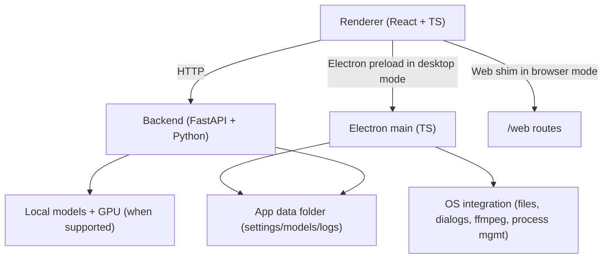

# LTX Desktop Web

A fork of **LTX Desktop** with major additions for **GGUF**, **lower-VRAM local inference**, **custom LoRA support**, and a new **browser-based web mode**.

Compared with `LTX-Desktop`, this fork adds:

- **Web mode**: run the app in a browser without Electron
- **Low-VRAM local generation pipeline** for consumer NVIDIA GPUs
- **VRAM-aware run modes**: Auto / High / Medium / Low / Very Low
- **Sequential offloading + block swap** for transformer and text encoder
- **SageAttention integration** for faster attention kernels where supported
- **GGUF video model support** including GPU-tier-based quant recommendations
- **Lazy GGUF loading**
- **Custom model selection** for:
  - diffusion checkpoints / GGUF files
  - LoRAs
  - text encoder variants
  - upscaler
  - processor models
- **Multiple custom LoRA support**
- **VRAM profile endpoint/UI** and GPU stats widget
- **Improved first-run setup** for local model recommendations

## Features

- Text-to-video generation
- Image-to-video generation
- Audio-to-video generation
- Video edit generation (Retake)
- IC-LoRA / style transfer workflows
- Video Editor interface
- Timeline gap-fill prompt suggestions
- Video editing projects
- Desktop mode via Electron
- Web mode via browser + FastAPI

## Local mode

| Platform / hardware | Generation mode | Notes |
| --- | --- | --- |
| Windows + NVIDIA CUDA GPU | Local generation supported | Recommended for 11GB+ VRAM |
| Linux + NVIDIA CUDA GPU | Local generation supported | Recommended for 11GB+ VRAM |
| macOS (Apple Silicon builds) | Not supported | - |

## VRAM requirements and local generation tiers

This fork no longer assumes you need a **32GB+ GPU** for local generation.
Local generation is now tiered and can run on smaller NVIDIA GPUs using:

- sequential offloading
- block swap
- FP8 where supported
- optional GGUF quantized models
- lower resolution / lower frame-count limits on smaller cards

### Recommended tiers

| VRAM tier | GPU memory | Typical mode | Recommended local resolutions |
| --- | --- | --- | --- |
| High VRAM | **24GB+** | Best local experience | 540p, 720p, 1080p |
| Medium VRAM | **16-23GB** | Strong local experience | 540p, 720p |
| Low VRAM | **12-15GB** | Works with heavier offloading | 480p, 540p |
| Very Low VRAM | **8-11GB** | Most constrained local mode | 360p, 480p |

### Important notes

- **48GB+ VRAM** is the only range where the full model stack can realistically stay on GPU without the low-VRAM tricks.
- **24GB GPUs are supported locally**, but still rely on offloading / block swap for this fork's LTX 2.3 workflows.
- **12GB GPUs are experimental but supported** through aggressive offloading and lower resolutions.
- Performance depends on:
  - selected resolution / frame count
  - GGUF quant level
  - whether upscaler refinement is enabled
  - LoRAs / conditioning inputs
  - PCIe / CPU memory bandwidth

### Practical guidance

- **24GB+**: use `Auto` or `High VRAM`; prefer `Q8_0` GGUF if using quantized models
- **16-23GB**: use `Auto` or `Medium VRAM`; `Q5_1` / `Q4_K_M` GGUF is often a good fit
- **12-15GB**: use `Low VRAM`; prefer `Q4_K_M`
- **8-11GB**: use `Very Low VRAM`; prefer `Q4_0` and smaller resolutions

## System requirements

### Windows / Linux (local generation)

- 64-bit OS
- NVIDIA GPU with CUDA support
- **12GB+ VRAM minimum for local mode**
- NVIDIA driver installed
- 16GB+ system RAM recommended (32GB+ preferred for smoother low-VRAM workflows)
- Plenty of disk space for model weights and outputs

### VRAM-specific recommendations

- **8-11GB VRAM**: local generation possible at lower resolutions with aggressive offloading
- **12-15GB VRAM**: better local generation headroom, typically up to 540p
- **16-23GB VRAM**: comfortable local generation, often up to 720p
- **24GB+ VRAM**: best local experience, often up to 1080p

## Install

1. Download the latest installer from GitHub Releases: [Releases](../../releases)
2. Install and launch **LTX Desktop**
3. Complete first-run setup

## First run & data locations

LTX Desktop stores app data (settings, models, logs) in:

- **Windows:** `%LOCALAPPDATA%\LTXDesktop\`
- **macOS:** `~/Library/Application Support/LTXDesktop/`
- **Linux:** `$XDG_DATA_HOME/LTXDesktop/` (default: `~/.local/share/LTXDesktop/`)

Model weights are downloaded into the `models/` subfolder (this can be large and may take time).

On first launch you may be prompted to review/accept model license terms (license text is fetched from Hugging Face; requires internet).

This fork also adds GPU-aware first-run checks that can suggest a more suitable local model bundle for your hardware.

## Model support in this fork

This fork expands model file handling beyond the default upstream assumptions.

### Supported / surfaced model categories

- **Diffusion checkpoints** (`.safetensors`)
- **GGUF checkpoints** (`.gguf`)
- **Distilled LoRA**
- **IC-LoRA**
- **Text encoder variants** (`.safetensors`, `.gguf`, and variant directories)
- **2x spatial upscaler**
- **Depth / pose / person processor models**
- **Z-Image Turbo model variants**

### Supported workflows

- **Fast**: distilled base / fast settings
- **Balanced**: dev base + distilled LoRA at 8 steps
- **Quality / Pro**: dev base with configurable steps and optional 2x refinement
- **Custom**: choose your own checkpoint / GGUF / LoRAs / text encoder

## Text encoding

To generate videos you must configure text encoding:

- **Local text encoder** — download a local text encoder variant if you want a more fully local setup.

This fork also supports selecting custom local text encoder variants, including GGUF-backed options where available.

### Gemini API key (optional)

Used for AI prompt suggestions. When enabled, prompt context and frames may be sent to Google Gemini.

Current Gemini usage in this fork is focused on **prompt suggestion flows** such as timeline gap-fill prompt generation and prompt inference for imported assets.

## Web mode

This fork can run as a standalone browser app using the same backend.

### Quick start

```bash
python run.py --host 127.0.0.1 --port 8000
```

Then open:

```text
http://127.0.0.1:8000
```

### Alternative helper scripts

```bash
./run-web.sh
./restart-web.sh
./stop-web.sh
```

### What web mode adds

- Browser-based UI without Electron
- HTTP replacements for Electron file / app IPC
- Backend-served file upload and asset persistence helpers
- Shared frontend codepath between desktop and web deployments

## Architecture

LTX Desktop is split into three main layers:

- **Renderer (`frontend/`)**: TypeScript + React UI.
  - Calls the local backend over HTTP.
  - Uses Electron in desktop mode.
  - Falls back to a web shim in browser mode.
- **Electron (`electron/`)**: TypeScript main process + preload.
  - Owns app lifecycle and OS integration in desktop builds.
- **Backend (`backend/`)**: Python + FastAPI local server.
  - Orchestrates generation, model downloads, GPU execution, web-mode routes, and model selection.



## Development (quickstart)

Prereqs:

- Node.js
- `uv` (Python package manager)
- Python 3.13+
- Git

Setup:

```bash
pnpm setup:dev
```

Desktop dev:

```bash
pnpm dev
```

Debug:

```bash
pnpm dev:debug
```

Typecheck:

```bash
pnpm typecheck
```

Backend tests:

```bash
pnpm backend:test
```

### Running in web mode during development

Backend:

```bash
cd backend
uv run python ltx2_server.py
```

Frontend:

```bash
WEB_MODE=true BACKEND_URL=http://127.0.0.1:8000 npx vite --host
```

Or use:

```bash
python run.py
```

## Telemetry

LTX Desktop collects minimal, anonymous usage analytics (app version, platform, and a random installation ID) to help prioritize development. No personal information or generated content is collected. Analytics is enabled by default and can be disabled in **Settings > General > Anonymous Analytics**. See [`TELEMETRY.md`](docs/TELEMETRY.md) for details.

## Docs

- [`INSTALLER.md`](docs/INSTALLER.md) — building installers
- [`TELEMETRY.md`](docs/TELEMETRY.md) — telemetry and privacy
- [`backend/architecture.md`](backend/architecture.md) — backend architecture

## Contributing

See [`CONTRIBUTING.md`](docs/CONTRIBUTING.md).

## License

Apache-2.0 — see [`LICENSE.txt`](LICENSE.txt).

Third-party notices (including model licenses/terms): [`NOTICES.md`](NOTICES.md).

Model weights are downloaded separately and may be governed by additional licenses/terms.
